# STM1 최종 정리 (2026-07-24)

STM1(NUCLEO-F401RE, 홀센서+불꽃센서 보드) 개발 전체 과정을 처음부터 끝까지 정리한 문서. 개별 기록은 [`STM1_pipeline_test_2026-07-21.md`](STM1_pipeline_test_2026-07-21.md)(초기 배관 검증)와 [`STM1_flame_sensor_validation_2026-07-23.md`](STM1_flame_sensor_validation_2026-07-23.md)(실물 화염센서 검증)에 있고, 이 문서는 그걸 포함해 전체를 한 번에 훑어볼 수 있게 재구성한 것.

관련 티켓: [EVDA-78](https://black7599.atlassian.net/browse/EVDA-78)(홀센서), [EVDA-47](https://black7599.atlassian.net/browse/EVDA-47)(화염센서), [EVDA-81](https://black7599.atlassian.net/browse/EVDA-81)(UART), [EVDA-120](https://black7599.atlassian.net/browse/EVDA-120)(초기 설정)

---

## 1. 개발 환경 및 초기 설정 (EVDA-120)

- 보드: NUCLEO-F401RE, IDE: STM32CubeIDE 2.2.0(CubeMX 통합)
- 클럭: HSE(bypass, ST-Link MCO 8MHz) 기반 PLL로 SYSCLK 84MHz (PLLM=8, PLLN=336, PLLP=÷4)
- 핀맵: `PA0`(MUX_A) / `PA1`(MUX_B) 홀센서 채널 선택, `PA4`(MUX_COM) 홀센서 공통 입력, `PC0`(FLAME_A0) 화염센서 ADC 입력, `PA2`/`PA3` USART2(115200 8N1)

| | |
|---|---|
| 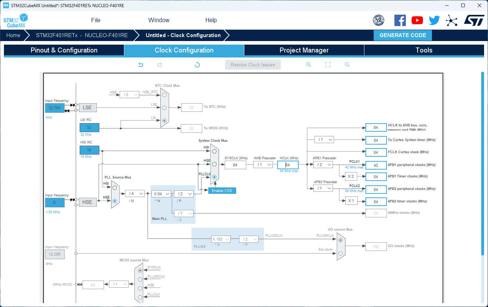 | 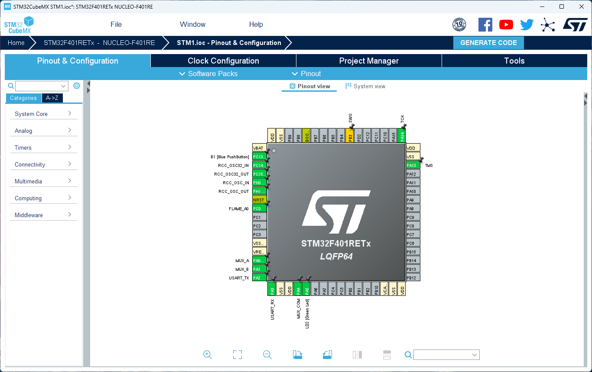 |
| HSE 84MHz 클럭 트리 | 전체 핀아웃 |
| 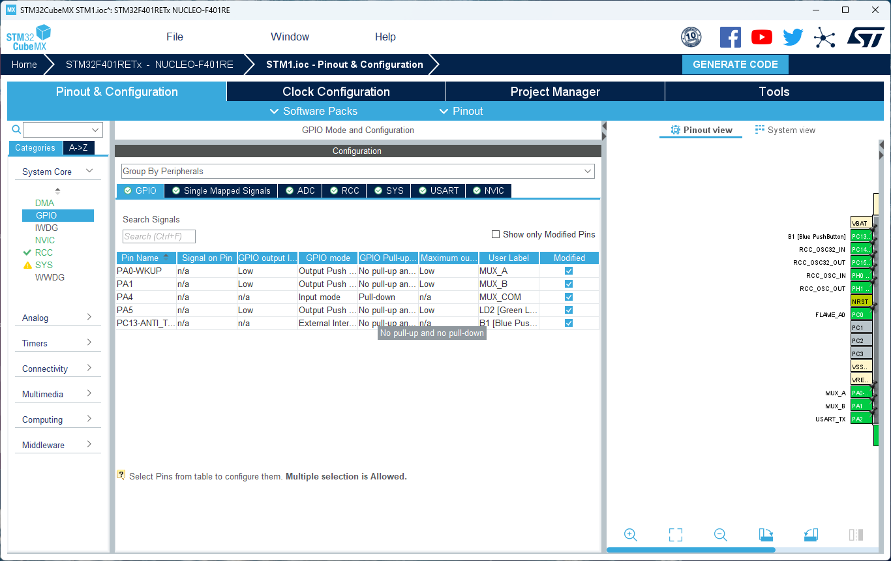 | 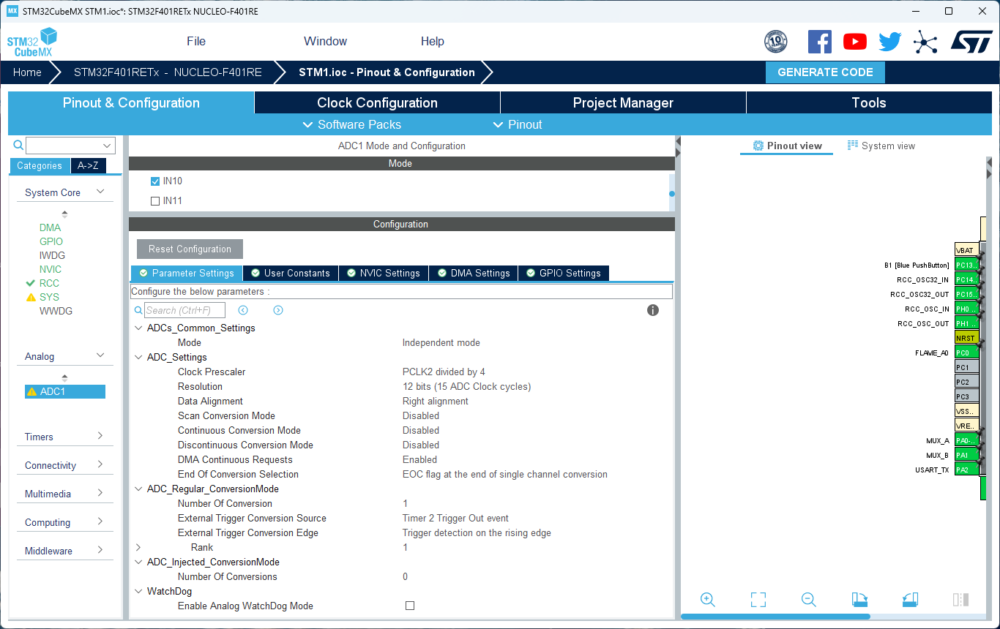 |
| GPIO 모드/풀업풀다운 설정 | ADC1 파라미터(480 cycles 샘플링) |
| 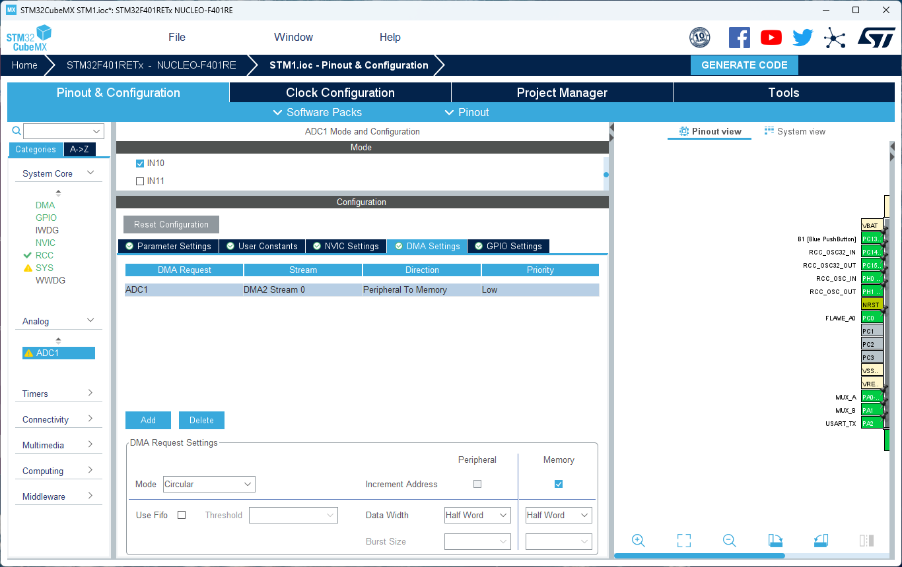 | 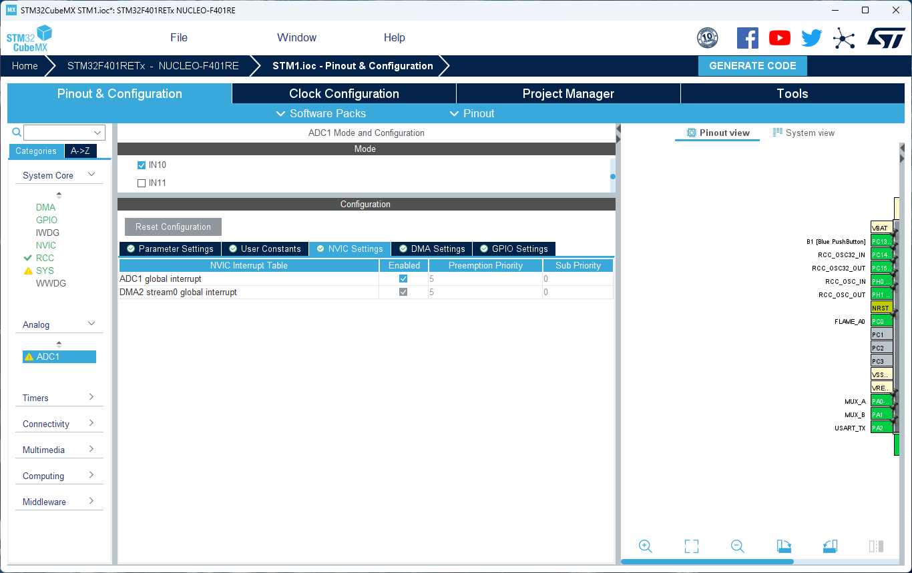 |
| ADC1 DMA circular 설정 | ADC1/DMA2 인터럽트 |
| 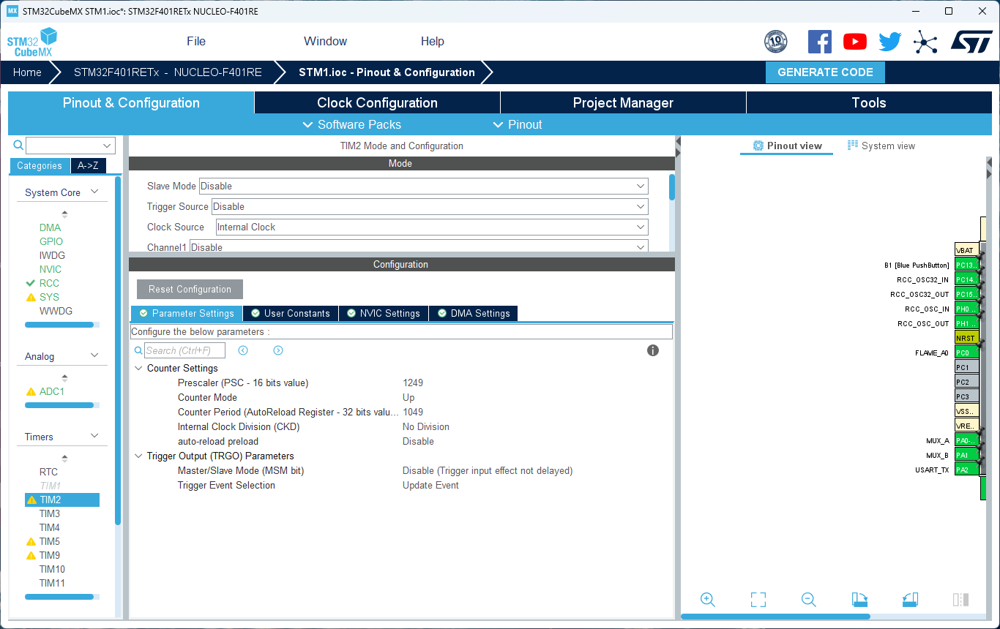 | 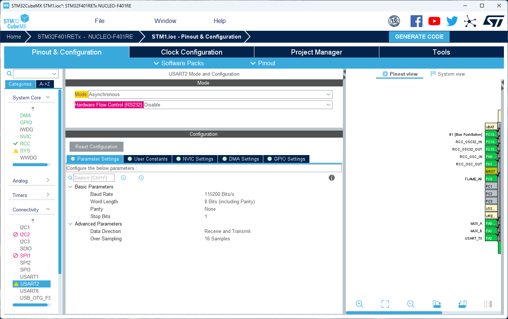 |
| TIM2 64Hz ADC 트리거 | USART2 115200 8N1 |
| 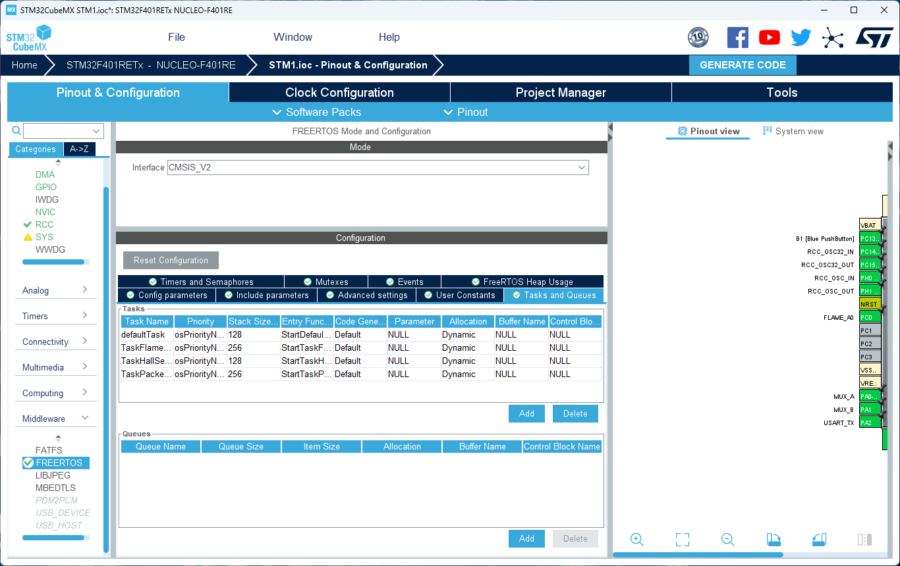 | |
| FreeRTOS 4개 태스크 정의 | |

**알려진 CubeMX 버그**: `.ioc`를 열어 코드를 재생성하면 `MX_FREERTOS_Init()`의 `osThreadNew(...)` 호출들이 빈 헤더 주석으로 대체되는 현상이 반복적으로 재현됨 — 재생성 직후 반드시 확인 후 복구할 것.

---

## 2. 홀센서 — CD4051 멀티플렉싱 + 비교기 회로 (EVDA-78)

### 2-1. 펌웨어 로직

`TaskHallSensor`가 50ms 주기로 4채널을 순회: `MUX_A`/`MUX_B`에 채널 코드 출력 → 1ms 지연(멀티플렉서 스위칭 안정화) → `MUX_COM` 읽기. 채널별로 같은 값이 5회(250ms) 연속 나와야 상태를 확정하는 디바운스를 적용했고, 부팅 직후 첫 확정값은 베이스라인으로만 저장하고 이벤트를 보내지 않는다(콜드부팅 스팸 방지). 이후 상태가 실제로 바뀔 때만 `SENSOR:sensor_0N:OCCUPIED|VACANT:<seq>` 형식으로 UART 전송.

### 2-2. 비교기 회로 — 가변저항 대체

홀센서 모듈(KY-024, 리니어 아날로그 출력)의 아날로그 신호를 비교기(LM339/LM239)로 디지털화하는 회로를 직접 구성. 원래는 가변저항으로 기준전압(threshold)을 잡으려 했으나 재고가 없어서, **고정저항 2개로 분압기**를 구성했다: VCC—R1—(비교기 기준전압 입력)—R2—GND. R1은 10kΩ으로 고정하고 R2 값을 바꿔가며(2kΩ~15kΩ 범위 테스트) "평상시 GREEN / 자석 시 RED"가 되는 지점을 실측으로 찾았다.

| | |
|---|---|
| 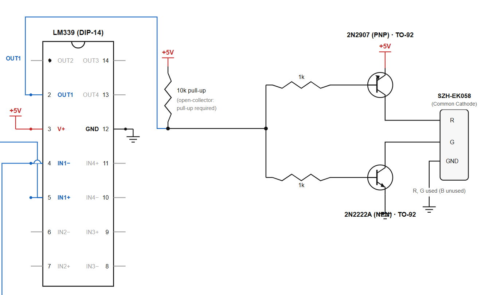 | 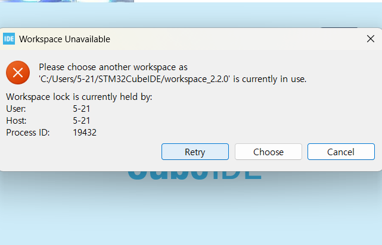 |
| LM339 비교기 + 풀업 + 트랜지스터 드라이버 회로도 | 브레드보드 최종 배치 |
| 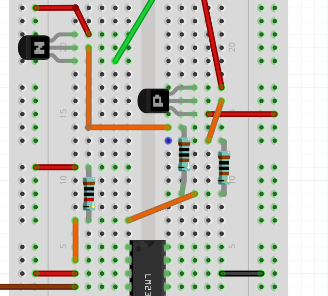 | |
| LM239 비교기 IC 및 저항 분압기 배치 | |

비교기 핀 확인 과정(핀아웃 재확인용):

| 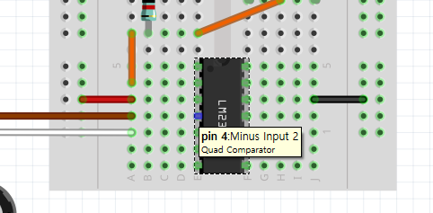 | 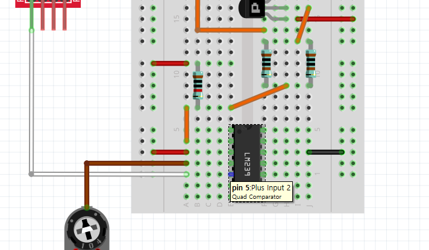 | 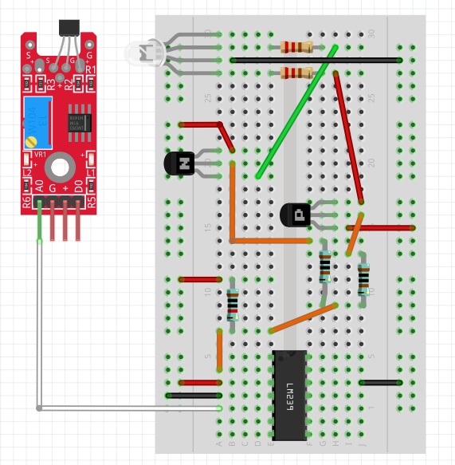 |
|---|---|---|
| pin 2: Output 2 | pin 4: Minus Input 2 | pin 5: Plus Input 2 |

**발견한 특성**: 이 비교기 회로는 KY-024 모듈의 온보드 디지털 출력(D0)과 **반대 극성**으로 반응한다 — 비교기 입력 핀에 신호선/기준전압선을 어느 쪽에 물렸는지에 따라 갈리는 것으로, 버그가 아니라 배선 선택의 결과. D0와 방향을 맞추고 싶으면 두 입력 핀을 서로 바꿔 꽂으면 된다.

**디버그 삽질 기록**: 자석 강도가 약해서 처음엔 반응이 없었는데, 강한 자석으로 바꾸니 바로 해결됨. 별도로 STM32 ADC/PC0 라인을 빌려 임시 디버그 프린트(`HALL_D0_TEST=%u`)를 추가해 D0 단독 테스트도 해봤는데, 이 과정에서 **printf가 한 글자씩 개별 `HAL_UART_Transmit` 호출로 나가면서 TaskPacketTX와 동시에 UART를 건드려 글자가 씹히는 레이스 컨디션**을 발견함(아래 로그). 한 줄을 통째로 `snprintf` 후 한 번에 전송하는 방식으로 고쳐서 해결.

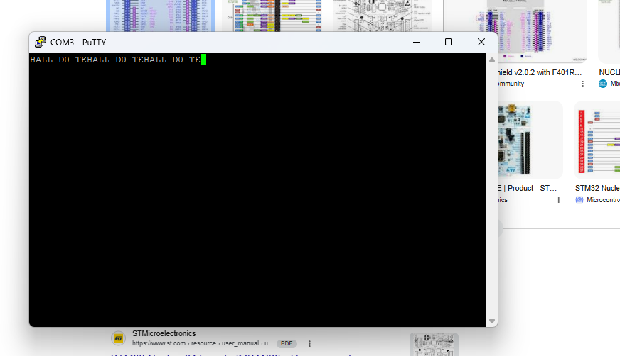
*여러 태스크가 동시에 printf로 UART를 건드릴 때 글자가 잘려나가는 레이스 컨디션 (`HALL_D0_TEST=0\r\n`이 `HALL_D0_TE`에서 반복적으로 끊김)*

**남은 것**: 지금은 홀센서 모듈 1개만 조립된 상태라 CD4051 멀티플렉서로 4채널을 동시에 검증하지 못함. 나머지 3개 모듈이 준비되면 채널별 독립 동작 재확인 필요.

---

## 3. 화염센서 — FFT + 하이브리드 판정 알고리즘 (EVDA-47)

### 3-1. 데이터 수집 파이프라인

TIM2가 64Hz로 ADC1(PC0)을 트리거, circular DMA로 `adc_buf[64]`에 저장(1초=64샘플 윈도우). `HAL_ADC_ConvCpltCallback`이 윈도우가 다 찰 때마다 세마포어를 release해서 `TaskFlameSensor`와 동기화.

초기(더미 신호/플로팅 핀) 검증 로그:

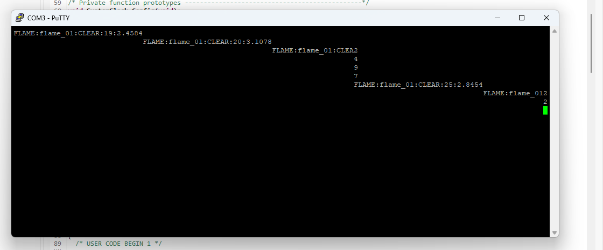
*센서 미장착 상태에서 CLEAR가 안정적으로 출력되는 초기 배관 검증 (2026-07-21)*

### 3-2. 실물 DFR0076 테스트 — 배선/설정 버그 2건

1. **ADC 샘플링 타임 버그**: `3 cycles`(최소값)로 설정돼 있어 센서 출력 임피던스에서 신호가 좁은 범위로 눌림 → `480 cycles`로 수정 (64Hz 변환 주기라 여유 충분)
2. **배선 실수**: Nucleo Arduino 헤더의 "A0" 라벨을 PA0으로 착각하고 배선했으나, 실제 펌웨어는 PC0을 읽고 있었음 → PC0로 재배선

### 3-3. FFT flicker 단독 판정의 한계 → 하이브리드 재설계

배선/샘플링 문제 해결 후 재테스트한 결과, 실제 불꽃은 완전한 주기 진동이 아니라 카오틱함:
- 점화 순간(라이터 켜는 동작 + 불꽃 안정화 전 흔들림)엔 flicker 에너지가 강하게 반응(실측 40~90대)
- 불꽃이 안정적으로 지속 연소하면 오히려 flicker가 잦아들어 baseline 수준으로, 완전 포화 시 정확히 `0.0000`까지 떨어짐

**최종 설계(하이브리드)**:
```c
raw_verdict = (energy >= FLAME_ENERGY_THRESHOLD /* 5.0 */)
           || (delta   >= FLAME_DELTA_THRESHOLD  /* 40.0 */);
```
- `energy`: FFT 1~20Hz 대역 magnitude 합 (점화/움직임 트리거)
- `delta`: 같은 윈도우의 raw ADC 평균과 부팅 시 baseline의 차이 (지속 연소 확인)
- 두 조건을 OR로 결합해 서로의 약점을 보완
- 카오틱한 flicker로 인한 순간적 소강을 흡수하기 위해 K-of-N 다수결 디바운스(최근 5윈도우 중 3개 이상 hit) 적용 — 기존 "N번 연속" 방식은 중간에 조용한 윈도우 하나 때문에 계속 리셋되는 문제가 있었음

### 3-4. 검증 결과

- 점화 → 지속연소(energy=0.0000 구간 포함) → 소화 전체 사이클에서 ALERT 유지 및 CLEAR 복귀 정상 확인
- 오탐 테스트(손 흔들기/빛 가림, 형광등, 모니터) 전부 통과
- 스택 오버플로우 위험 발견(`-fstack-usage`로 확인 시 FFT 버퍼만으로 프레임 704B인데 할당 스택 1024B) → 2048B로 증설, `configCHECK_FOR_STACK_OVERFLOW` 활성화
- **미실시**: 태양광 환경 오탐 테스트

---

## 4. UART 프로토콜 (EVDA-81)

Raspberry Pi 팀이 이미 구현해둔 파서 형식을 그대로 채택 — 당초 계획했던 `[STX][SRC_ID][MSG_TYPE][LEN][PAYLOAD][CRC-8][ETX]` 바이너리 프레임 대신, 실제로 소비하는 쪽 포맷에 맞춤:

```
SENSOR:sensor_0N:OCCUPIED|VACANT:<seq>\r\n
FLAME:flame_01:ALERT|CLEAR:<seq>:<energy>\r\n
```

`sensor_protocol.h/.c`로 인코딩 로직을 태스크 로직과 분리해둬서, 나중에 CRC/바이너리 프레이밍이 필요해져도(예: LoRa 전송 전환 시) 이 파일만 바꾸면 된다.

**PuTTY 디버그 UI 모드**: `SENSOR_DEBUG_UI`(sensor_protocol.h)를 1로 켜면, 원본 프로토콜 라인 대신 ANSI escape 기반 색상 강조 상태 테이블을 PuTTY에 출력한다. Pi가 파싱 못하는 화면이라 로컬 테스트 전용, 기본값 0.

**남은 것**: STM1→PuTTY 구간까지만 검증했고, 실제 Raspberry Pi 파서와의 연동(수신 테스트)은 아직 미검증.

---

## 5. 전체 요약

| 항목 | 상태 |
|---|---|
| 홀센서 로직 + 디바운스 | 완료 |
| 홀센서 비교기 회로(1개 모듈) | 완료, 나머지 3개 모듈 대기 |
| 화염센서 하이브리드 알고리즘 | 완료, 태양광 테스트만 남음 |
| UART 프로토콜 | 완료, Pi 실연동만 남음 |
| 초기 설정/클럭/빌드 | 완료 |
| PuTTY 디버그 대시보드 | 완료 |
